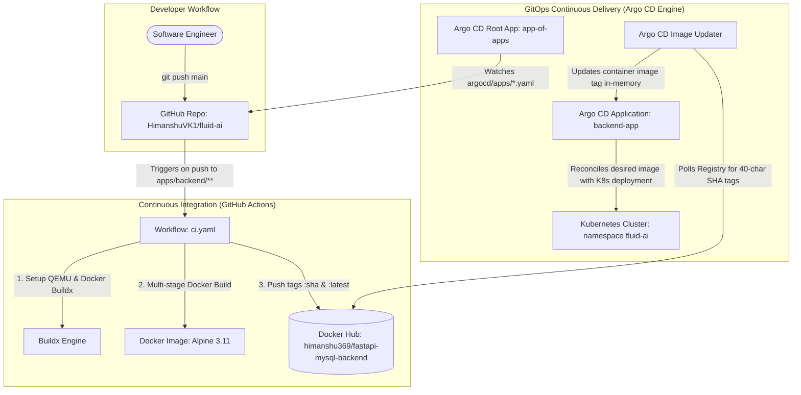
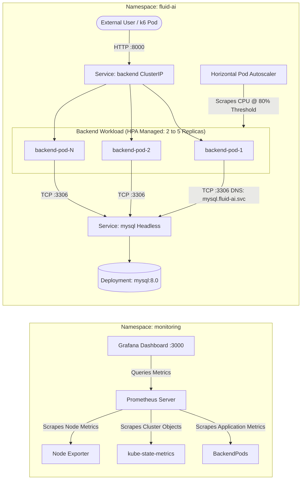

# Fluid AI — Cloud-Native Kubernetes & GitOps Platform

[](https://github.com/HimanshuVK1/fluid-ai/actions)
[](https://argoproj.github.io/argo-cd/)
[](https://kubernetes.io/)
[](https://fastapi.tiangolo.com/)
[](https://www.mysql.com/)
[](https://prometheus.io/)
[](https://k6.io/)

A production-style, resilient microservice application stack and GitOps delivery engine running on Kubernetes. This repository is built to demonstrate modern DevOps best practices: **declarative infrastructure**, **fully automated GitOps pipelines**, **reliability engineering (HPA, health probes, resource quotas)**, **end-to-end observability**, and **structured operational debugging**.

---

## 📑 Table of Contents

- [1. System Architecture](#1-system-architecture)
  - [1.1 GitOps Automated Delivery Architecture](#11-gitops-automated-delivery-architecture)
  - [1.2 In-Cluster Runtime Topology & Traffic Flow](#12-in-cluster-runtime-topology--traffic-flow)
- [2. Repository Directory Structure](#2-repository-directory-structure)
- [3. Component Deep Dive](#3-component-deep-dive)
  - [3.1 Backend Service (`apps/backend`)](#31-backend-service-appsbackend)
  - [3.2 Database Layer (`deploy/platform/mysql-db`)](#32-database-layer-deployplatformmysql-db)
  - [3.3 Observability Stack (`deploy/platform/monitoring`)](#33-observability-stack-deployplatformmonitoring)
- [4. GitOps & Continuous Delivery Engine](#4-gitops--continuous-delivery-engine)
  - [4.1 GitHub Actions CI Pipeline](#41-github-actions-ci-pipeline)
  - [4.2 ArgoCD "App-of-Apps" Pattern](#42-argocd-app-of-apps-pattern)
  - [4.3 Automated Continuous Deployment (ArgoCD Image Updater)](#43-automated-continuous-deployment-argocd-image-updater)
- [5. Reliability & Production Hardening](#5-reliability--production-hardening)
  - [5.1 Horizontal Pod Autoscaler (HPA)](#51-horizontal-pod-autoscaler-hpa)
  - [5.2 Liveness & Readiness Probes](#52-liveness--readiness-probes)
  - [5.3 Resource Quotas & Limits](#53-resource-quotas--limits)
- [6. Step-by-Step Bootstrap & Quickstart Guide](#6-step-by-step-bootstrap--quickstart-guide)
  - [6.1 Prerequisites](#61-prerequisites)
  - [6.2 Stand Up the Cluster & Deploy ArgoCD](#62-stand-up-the-cluster--deploy-argocd)
  - [6.3 Bootstrap the Entire Stack with App-of-Apps](#63-bootstrap-the-entire-stack-with-app-of-apps)
  - [6.4 Accessing the Services](#64-accessing-the-services)
- [7. Verification & Load Testing (Triggering Autoscaling)](#7-verification--load-testing-triggering-autoscaling)
- [8. Intentional Failure Simulation & Debugging Walkthrough](#8-intentional-failure-simulation--debugging-walkthrough)
  - [8.1 Failure Scenario: Database Connectivity Break](#81-failure-scenario-database-connectivity-break)
  - [8.2 Symptoms & Detection](#82-symptoms--detection)
  - [8.3 Diagnostic Investigation](#83-diagnostic-investigation)
  - [8.4 Root Cause & Automated Self-Healing Resolution](#84-root-cause--automated-self-healing-resolution)
- [9. Architectural Trade-offs & Production Scale Roadmap](#9-architectural-trade-offs--production-scale-roadmap)

---

## 1. System Architecture

The platform separates build concerns (Continuous Integration) from deployment state reconciliation (Continuous Delivery via GitOps), ensuring zero manual `kubectl` intervention in production.

### 1.1 GitOps Automated Delivery Architecture



### 1.2 In-Cluster Runtime Topology & Traffic Flow



---

## 2. Repository Directory Structure

```text
.
├── .github/
│   └── workflows/
│       └── ci.yaml                           # GitHub Actions workflow (Build & Push to Docker Hub)
├── apps/
│   └── backend/
│       ├── Dockerfile                        # Multi-stage, non-root Alpine container build
│       ├── main.py                           # FastAPI application (guestbook API & /health endpoint)
│       └── requirements.txt                  # Python dependencies (fastapi, uvicorn, pymysql)
├── argocd/
│   ├── app-of-apps.yaml                      # Root ArgoCD Application managing all sub-applications
│   └── apps/
│       ├── argocd-image-updater-app.yaml     # ArgoCD app deploying the Image Updater operator
│       ├── backend-app.yaml                  # ArgoCD app deploying backend service + updater annotations
│       ├── kube-prometheus-stack-app.yaml    # ArgoCD app deploying Prometheus + Grafana stack
│       └── mysql-app.yaml                    # ArgoCD app deploying MySQL database
├── deploy/
│   ├── platform/
│   │   ├── argocd-image-updator/             # Image Updater installation manifests and CRs
│   │   ├── monitoring/
│   │   │   └── kube-prometheus-stack/        # Helm Kustomization and custom Prometheus/Grafana values
│   │   └── mysql-db/                         # MySQL Deployment & Headless Service manifests
│   └── services/
│       └── backend/
│           ├── deployment-backend.yaml       # Backend Deployment, ClusterIP Service & HPA resource
│           └── kustomization.yaml            # Kustomize manifest for backend image tracking
├── loadtesting/
│   ├── README.md                             # Quickstart guide for running load tests
│   └── script.js                             # k6 load testing script for triggering HPA autoscaling
└── README.md                                 # Project documentation & architecture guide
```

---

## 3. Component Deep Dive

### 3.1 Backend Service (`apps/backend`)
The backend is a high-performance REST API built with **FastAPI** and **PyMySQL**.

- **Multi-Stage Non-Root Container (`Dockerfile`):**
  - **Stage 1 (`builder`):** Installs Python packages into an isolated virtual environment (`/opt/venv`). Build tools and pip caches are discarded.
  - **Stage 2 (Runtime):** Copies only `/opt/venv` and `main.py` onto a clean `python:3.11-alpine` base image.
  - **Least Privilege Security:** A dedicated system user `appuser` (non-root) owns the runtime process, reducing attack surfaces.
- **REST API Endpoints:**
  - `GET /health`: Diagnostic probe endpoint executing `SELECT 1` on MySQL. Returns `200 OK` when healthy, or `500 Internal Server Error` if the database is unreachable.
  - `POST /name`: Accepts `{"name": "string"}` and inserts a record into the `guestbook` table.
  - `GET /names`: Returns all records from `guestbook` sorted by ID, standardizing SQL timestamps into ISO-8601 strings.
- **Auto-Schema Migration:**
  - The `@app.on_event("startup")` hook automatically connects to MySQL, initializes the database `sampledb` if missing, and executes `CREATE TABLE IF NOT EXISTS guestbook`.

### 3.2 Database Layer (`deploy/platform/mysql-db`)
- **Engine:** Official `mysql:8.0` image.
- **Single-Writer Safety (`strategy: Recreate`):**
  - Uses `strategy: Recreate` instead of `RollingUpdate`. For single-pod relational databases, this guarantees the previous instance is completely terminated before a new pod mounts the data volume, preventing InnoDB storage corruption.
- **Deterministic In-Cluster DNS (`Headless Service`):**
  - Exposed via a Headless Service (`clusterIP: None`) on port `3306`. This allows the backend to resolve the database directly via internal CoreDNS: `mysql.fluid-ai.svc.cluster.local:3306`.

### 3.3 Observability Stack (`deploy/platform/monitoring`)
- Packaged via Kustomize Helm integration using `kube-prometheus-stack` (v72.6.2).
- **Components Included:**
  - **Prometheus Operator & Server:** Collects metrics with 7-day retention.
  - **Grafana:** Pre-provisioned with administration dashboards and pre-wired datasources (Prometheus, Loki, Tempo).
  - **Node Exporter:** Gathers hardware and OS metrics from Kubernetes worker nodes.
  - **Kube-State-Metrics:** Scrapes and evaluates health and counts of Kubernetes objects (Deployments, Pods, HPA state).

---

## 4. GitOps & Continuous Delivery Engine

### 4.1 GitHub Actions CI Pipeline
Located in `.github/workflows/ci.yaml`:
1. Triggers automatically upon code pushes to `main` modifying files in `apps/backend/**`.
2. Sets up QEMU and Docker Buildx.
3. Authenticates with Docker Hub using repository secrets (`DOCKERHUB_USERNAME`, `DOCKERHUB_TOKEN`).
4. Builds the multi-stage image using GitHub Actions cache (`type=gha`) for ultra-fast build times.
5. Tags and pushes two image tags:
   - `himanshu369/fastapi-mysql-backend:latest`
   - `himanshu369/fastapi-mysql-backend:<git-commit-sha>` (40-character immutable SHA tag).

### 4.2 ArgoCD "App-of-Apps" Pattern
Instead of managing multiple disparate applications manually, `argocd/app-of-apps.yaml` acts as the single declarative root:
- The root Application synchronizes all Application manifests in `argocd/apps/`.
- Automated sync policies (`automated: {prune: true, selfHeal: true}`) ensure that adding, modifying, or removing a YAML manifest in `argocd/apps/` instantly propagates across the cluster without manual intervention.

### 4.3 Automated Continuous Deployment (ArgoCD Image Updater)
Continuous delivery of newly built Docker images is orchestrated via **ArgoCD Image Updater** using the following annotations on `argocd/apps/backend-app.yaml`:

```yaml
annotations:
  # 1. Track the Docker Hub image repository
  argocd-image-updater.argoproj.io/image-list: backend-app=himanshu369/fastapi-mysql-backend

  # 2. Filter for 40-character Git commit SHAs and pick the latest build
  argocd-image-updater.argoproj.io/backend-app.update-strategy: newest-build
  argocd-image-updater.argoproj.io/backend-app.allow-tags: regexp:^[0-9a-f]{40}$
  argocd-image-updater.argoproj.io/backend-app.sort: date

  # 3. Apply the updated tag directly into ArgoCD live memory (no Git write-back required)
  argocd-image-updater.argoproj.io/write-back-method: argocd
```

**Why this design?**
By utilizing `write-back-method: argocd`, ArgoCD applies image updates directly to its live application parameters. This eliminates the need for personal access tokens (PATs) or CI bots pushing Git commits back to the repository, avoiding circular trigger loops and merge conflicts.

---

## 5. Reliability & Production Hardening

### 5.1 Horizontal Pod Autoscaler (HPA)
The backend includes a native `HorizontalPodAutoscaler` (`autoscaling/v2`):
- **Scale Range:** Minimum **2 replicas** (ensuring High Availability), Maximum **5 replicas**.
- **Metric Target:** Average CPU utilization threshold of **80%**.
- **Self-Healing & Scalability:** During traffic spikes, HPA scales pods dynamically. When traffic subsides, it smoothly scales back to 2 replicas, preventing unnecessary compute consumption.

```yaml
apiVersion: autoscaling/v2
kind: HorizontalPodAutoscaler
metadata:
  name: backend-hpa
  namespace: fluid-ai
spec:
  scaleTargetRef:
    apiVersion: apps/v1
    kind: Deployment
    name: backend
  minReplicas: 2
  maxReplicas: 5
  metrics:
  - type: Resource
    resource:
      name: cpu
      target:
        type: Utilization
        averageUtilization: 80
```

### 5.2 Liveness & Readiness Probes
Both probes target `/health`, which validates active database responsiveness (`SELECT 1`).

| Probe | Path | Initial Delay | Period | Timeout | Failure Threshold | Operational Purpose |
|---|---|---|---|---|---|---|
| **Readiness** | `/health` | 5s | 5s | 2s | 2 | **Traffic Protection:** If MySQL is restarting or network fails, the backend immediately fails readiness. Kubernetes removes the pod from the Service endpoints, shielding end-users from HTTP 500 errors. |
| **Liveness** | `/health` | 10s | 10s | 3s | 3 | **Deadlock Recovery:** If the Python runtime deadlocks, freezes, or exhausts worker threads, the kubelet kills and restarts the pod automatically. |

### 5.3 Resource Quotas & Limits
Explicit CPU and memory boundaries are enforced:
- **Requests:** `cpu: 100m`, `memory: 100Mi` — Provides Kubernetes scheduler with exact sizing requirements and gives the Metrics Server an accurate baseline for HPA calculation.
- **Limits:** `cpu: 150m`, `memory: 150Mi` — Hard ceiling that prevents rogue processes or memory leaks from crashing adjacent workloads on the node (avoids node OOM killer invocation).

---

## 6. Step-by-Step Bootstrap & Quickstart Guide

### 6.1 Prerequisites
- A running Kubernetes cluster (Kind, Minikube, k3s, EKS, or GKE).
- `kubectl` configured with cluster access.
- `helm` v3 installed (for Prometheus CRDs).

### 6.2 Stand Up the Cluster & Deploy ArgoCD

1. **Install ArgoCD:**
   ```bash
   kubectl create namespace argocd
   kubectl apply -n argocd -f https://raw.githubusercontent.com/argoproj/argo-cd/stable/manifests/install.yaml
   ```

2. **Wait for ArgoCD Server to be Ready:**
   ```bash
   kubectl wait --for=condition=available deployment/argocd-server -n argocd --timeout=300s
   ```

3. **Retrieve Default ArgoCD Admin Password:**
   ```bash
   kubectl -n argocd get secret argocd-initial-admin-secret -o jsonpath="{.data.password}" | base64 -d; echo
   ```

### 6.3 Bootstrap the Entire Stack with App-of-Apps

Deploy the single root application:
```bash
kubectl apply -f argocd/app-of-apps.yaml
```

ArgoCD will automatically discover and sync all sub-applications:
- `argocd-image-updater-app` $\to$ Namespace `argocd`
- `mysql-app` $\to$ Namespace `fluid-ai`
- `backend-app` $\to$ Namespace `fluid-ai`
- `kube-prometheus-stack-app` $\to$ Namespace `monitoring`

Verify all resources are healthy:
```bash
kubectl get applications -n argocd
kubectl get pods -n fluid-ai
kubectl get pods -n monitoring
```

### 6.4 Accessing the Services

**1. FastAPI Backend:**
```bash
kubectl port-forward svc/backend 8000:8000 -n fluid-ai
```
- Interactive API Docs (Swagger UI): [http://localhost:8000/docs](http://localhost:8000/docs)
- Health Check: [http://localhost:8000/health](http://localhost:8000/health)
- Guestbook List: [http://localhost:8000/names](http://localhost:8000/names)

**2. Grafana Dashboard:**
```bash
kubectl port-forward svc/kube-prometheus-stack-grafana 3000:80 -n monitoring
```
- Open [http://localhost:3000](http://localhost:3000)
- Username: `admin` | Password: `admin`

**3. ArgoCD UI:**
```bash
kubectl port-forward svc/argocd-server 8080:443 -n argocd
```
- Open [https://localhost:8080](https://localhost:8080)
- Username: `admin`

---

## 7. Verification & Load Testing (Triggering Autoscaling)

The repository provides an automated load testing script using **k6** (`loadtesting/script.js`).

### Run Load Test In-Cluster (Zero Local Setup)
Execute the load test as an ephemeral pod within the cluster. It sends continuous requests (`/health`, `POST /name`, `GET /names`) across the backend pods using internal cluster DNS:

**In Bash / Linux / macOS:**
```bash
cat loadtesting/script.js | kubectl run k6-test-$RANDOM --rm -i --image=grafana/k6:latest -n fluid-ai --restart=Never --command -- k6 run -
```

**In Windows PowerShell:**
```powershell
Get-Content loadtesting/script.js | kubectl run "k6-test-$(Get-Random)" --rm -i --image=grafana/k6:latest -n fluid-ai --restart=Never --command -- k6 run -
```

### Observe Autoscaling in Real-Time
In a second terminal window, watch the HPA dynamically scale the backend pods as CPU utilization surpasses 80%:

```bash
# Watch HPA replica scaling
kubectl get hpa backend-hpa -n fluid-ai --watch
```

Output transitions:
```text
NAME          REFERENCE            TARGETS   MINPODS   MAXPODS   REPLICAS   AGE
backend-hpa   Deployment/backend   22%/80%   2         5         2          5m
backend-hpa   Deployment/backend   114%/80%  2         5         2          6m
backend-hpa   Deployment/backend   95%/80%   2         5         4          7m
backend-hpa   Deployment/backend   78%/80%   2         5         5          8m
```

Inspect individual pod CPU consumption:
```bash
kubectl top pods -n fluid-ai
```

---

## 8. Intentional Failure Simulation & Debugging Walkthrough

> **Context:** A mandatory requirement of production readiness is verifying that systems fail gracefully and operators possess structured debugging playbooks.

### 8.1 Failure Scenario: Database Connectivity Break
We simulate an unexpected downstream database outage.

**Simulate Failure:** Scale the MySQL deployment to 0 replicas:
```bash
kubectl scale deployment mysql -n fluid-ai --replicas=0
```

---

### 8.2 Symptoms & Detection
1. **Application Endpoint Degraded:**
   ```bash
   curl http://localhost:8000/health
   # Response: HTTP 500 Internal Server Error
   # {"status": "unhealthy", "database": "disconnected", "error": "(2003, \"Can't connect to MySQL server...\")"}
   ```

2. **Pod Readiness Failure:**
   Running `kubectl get pods -n fluid-ai` reveals:
   ```text
   NAME                       READY   STATUS    RESTARTS   AGE
   backend-7dbb86f99b-2jk89   0/1     Running   0          10m
   backend-7dbb86f99b-x9qwp   0/1     Running   0          10m
   ```
   Notice that while the containers are `Running`, they show `0/1 READY`.

3. **Traffic Cut-Off Protection:**
   Check the Service endpoints:
   ```bash
   kubectl get endpoints backend -n fluid-ai
   ```
   Output:
   ```text
   NAME      ENDPOINTS   AGE
   backend   <none>      12m
   ```
   **Key Architectural Insight:** Kubernetes immediately extracted the backend pods from the load balancing pool because the readiness probe failed. No incoming external traffic is routed to failing pods!

---

### 8.3 Diagnostic Investigation (Operator Playbook)

**Step 1: Check Pod Status & Events**
```bash
kubectl describe pod -l app=backend -n fluid-ai
```
Under **Events**, you observe:
```text
Warning  Unhealthy  15s (x4 over 35s)  kubelet  Readiness probe failed: HTTP probe failed with statuscode: 500
```

**Step 2: Inspect Application Logs**
```bash
kubectl logs -n fluid-ai -l app=backend --tail=30
```
Log output confirms:
```text
ERROR:backend:Health check failed: (2003, "Can't connect to MySQL server on 'mysql' ([Errno 111] Connection refused)")
```

**Step 3: Investigate Dependency Status**
```bash
kubectl get pods,svc -l app=mysql -n fluid-ai
```
Output shows `deployment.apps/mysql` has `0/0` replicas available, isolating the root cause directly to database availability.

---

### 8.4 Root Cause & Automated Self-Healing Resolution

**Root Cause:** The backend application is functioning properly, but the MySQL database instance was offline, triggering the database-aware `/health` readiness probe to fail.

**Apply Resolution:** Restore database availability:
```bash
kubectl scale deployment mysql -n fluid-ai --replicas=1
```

**Verify Self-Healing:**
1. MySQL pod boots and becomes ready.
2. Within 5 seconds, the backend readiness probe succeeds.
3. Backend pods return to `1/1 READY`.
4. Endpoints automatically re-populate with pod IPs (`kubectl get endpoints backend -n fluid-ai`).
5. Requests to `/health` return `{"status": "healthy", "database": "connected"}` without needing any backend restarts or manual pod deletions.

---

## 9. Architectural Trade-offs & Production Scale Roadmap

Every system architecture balances engineering velocity against production operational complexity. Below is an honest engineering analysis of design trade-offs made in this repository versus enterprise-scale standards:

| Architectural Area | Challenge Implementation | Trade-off Rationale | What Breaks at Scale (10x–100x) | Enterprise Production Standard |
|---|---|---|---|---|
| **Database Architecture** | In-cluster MySQL Deployment with `emptyDir: {}` | Rapid, dependency-free local spin-up on any lightweight cluster. | Data loss upon pod restart; storage I/O contention; single-point-of-failure (SPOF) with zero failover. | Managed Cloud Database (AWS RDS / GCP Cloud SQL) Multi-AZ, or Distributed Operator (Vitess / CloudNativePG / Percona). |
| **Secrets Management** | Kubernetes Deployment Environment Variables | Avoids complex external vault setup during local evaluation. | Secrets stored in plaintext in YAML and visible in pod specs; lacks audit logging or automatic rotation. | HashiCorp Vault or External Secrets Operator (ESO) syncing from AWS Secrets Manager / Azure Key Vault. |
| **Ingress & TLS** | Kubernetes Service Port-Forwarding / NodePort | Zero cloud-provider dependencies; portable across Minikube, Kind, and VMs. | Port-forwarding cannot handle external production internet traffic, SSL/TLS termination, or path-based routing. | NGINX Ingress Controller or AWS Load Balancer Controller + cert-manager (Let's Encrypt automated TLS certificates). |
| **Database Migrations** | Startup Event Hook (`@app.on_event("startup")`) | Guarantees tables exist before any requests hit FastAPI. | Race conditions and table lock contention when multiple backend replicas start simultaneously under HPA. | Kubernetes Pre-upgrade `Job` (Helm hook / ArgoCD Sync Hook) running schema tools (Alembic / Flyway). |
| **Connection Pooling** | Direct PyMySQL connection per request | Simple, stateless code with minimal memory footprint. | Database connection pool exhaustion (`Too many connections`) under heavy HPA scale. | Connection pooling via SQLAlchemy / ProxySQL or PgBouncer proxy layer. |
| **Image Tag Write-Back** | ArgoCD In-Memory (`write-back-method: argocd`) | Completely eliminates the need for Git write credentials or CI personal access tokens (PAT). | Desired tag in Git repo differs from live tag in ArgoCD memory if an out-of-band hard Git sync is forced. | Git write-back (`write-back-method: git`) targeting a dedicated environment configuration branch via a CI machine user. |

---

## 💡 Summary of Challenge Criteria Addressed

- **Requirement 1 (Working Deployment):** FastAPI backend + MySQL database fully orchestrated and verified on Kubernetes.
- **Requirement 2 (Automated CI/CD):** GitHub Actions automated multi-stage container build + ArgoCD declarative GitOps with automated tag updates.
- **Requirement 3 (Reliability Improvement):** Horizontal Pod Autoscaler (HPA), Liveness & Readiness Probes, and CPU/Memory resource constraints.
- **Requirement 4 (Intentional Failure Simulation):** Live database failure demonstration with symptoms, triage commands, and automated recovery.
- **Presentation Walkthrough:** Clear Mermaid architecture diagrams, load testing reproduction steps, and exhaustive scaling trade-offs.
